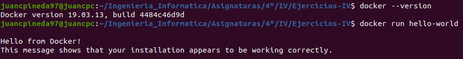
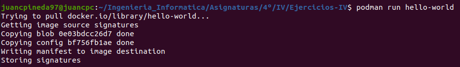

# Ejercicios Tema 3 - Virtualización ligera usando contenedores

## #1 Instalar docker y/o otro gestor de contenedores como Podman/Buildah.

- Instalación de docker: Se ha realizado correctamente la instalación de Docker, además de la configuración necesaria para no tener que ejecutar docker con el usuario root. Además, se ejecuta el comando `docker run hello-world` para comprobar su funcionamiento:

    

- Instalación Podman: Después de seguir ls instrucciones de instalación de la siguiente [página](https://podman.io/getting-started/installation), se puede apreciar en la siguiente captura su correcto funcionamiento:

    