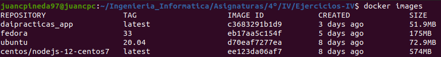
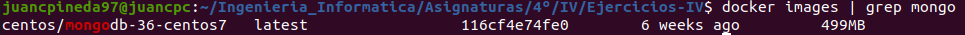

# Ejercicios Tema 3 - Virtualización ligera usando contenedores

## Ejercicio #1
### Instalar docker y/o otro gestor de contenedores como Podman/Buildah.

- Instalación de docker: Se ha realizado correctamente la instalación de Docker, además de la configuración necesaria para no tener que ejecutar docker con el usuario root. Además, se ejecuta el comando `docker run hello-world` para comprobar su funcionamiento:

    

- Instalación Podman: Después de seguir ls instrucciones de instalación de la siguiente [página](https://podman.io/getting-started/installation), se puede apreciar en la siguiente captura su correcto funcionamiento:

    

## Ejercicio #2
### Instalar a partir de docker una imagen alternativa de Ubuntu y alguna adicional, por ejemplo de CentOS. Buscar e instalar una imagen que incluya MongoDB.

- Como se puede apreciar en la siguiente captura, he instalado a partir de docker varias imágenes diferentes, como la versión 20.04 de ubuntu, la versión 33 de fedora, o una versión de centos con node instalado:
  
    

- He instalado una versión de centos que viene con mongodb instalado, como se aprecia en la siguiente captura:

    