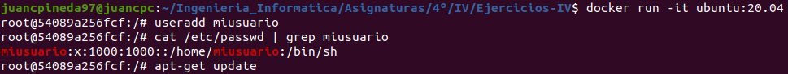
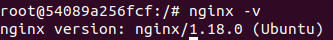
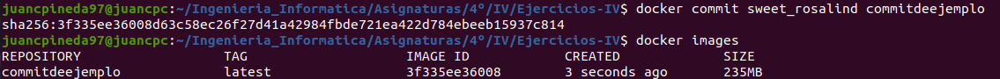

# Ejercicios Tema 3 - Virtualización ligera usando contenedores

## Ejercicio #1
### Instalar docker y/o otro gestor de contenedores como Podman/Buildah.

- Instalación de docker: Se ha realizado correctamente la instalación de Docker, además de la configuración necesaria para no tener que ejecutar docker con el usuario root. Además, se ejecuta el comando `docker run hello-world` para comprobar su funcionamiento:

    

- Instalación Podman: Después de seguir ls instrucciones de instalación de la siguiente [página](https://podman.io/getting-started/installation), se puede apreciar en la siguiente captura su correcto funcionamiento:

    

## Ejercicio #2
### Instalar a partir de docker una imagen alternativa de Ubuntu y alguna adicional, por ejemplo de CentOS. Buscar e instalar una imagen que incluya MongoDB.

- Como se puede apreciar en la siguiente captura, he instalado a partir de docker varias imágenes diferentes, como la versión 20.04 de ubuntu, la versión 33 de fedora, o una versión de centos con node instalado:
  
    

- He instalado una versión de centos que viene con mongodb instalado, como se aprecia en la siguiente captura:

    

## Ejercicio #3
### Crear un usuario propio e instalar alguna aplicación tal como nginx en el contenedor creado de esta forma, usando las órdenes propias del sistema operativo con el que se haya inicializado el contenedor.

Para realizar esta tarea, ejecutaré el comando `useradd miusuario` con el contenedor corriendo para crear un nuevo usuario, que comprobaré cómo se ha creado correctamente con el comando `cat /etc/passwd | grep miusuario`. Posteriormente ejecutaré `apt-get update` para actualizar los repositorios, `apt-get install nginx` para instalar nginx y con `nginx -v` compruebo que se ha instalado: 

## Ejercicio #4
### Crear a partir del contenedor anterior una imagen persistente con commit.

Con el comando `docker commit sweet_rosalind comitdeejemplo` creo un commit sobre el docker creado anteriormente, y con `docker images` se puede ver que efectivamente se ha creado:

