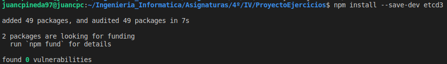
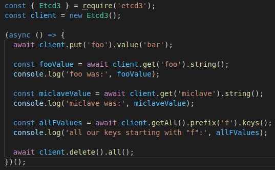
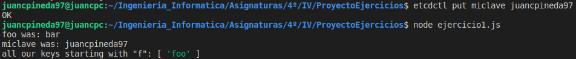
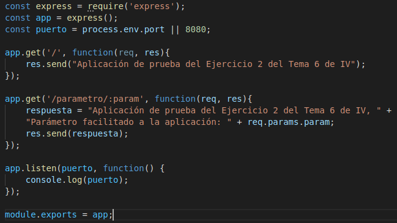
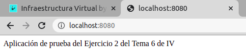
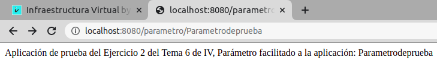
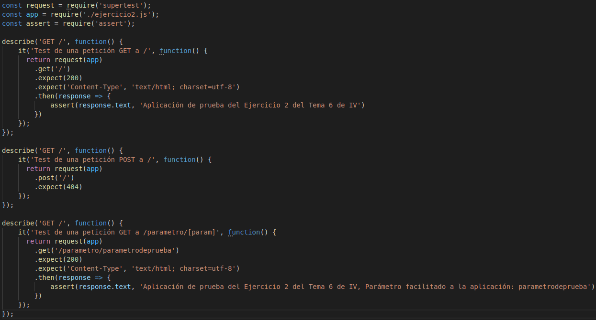
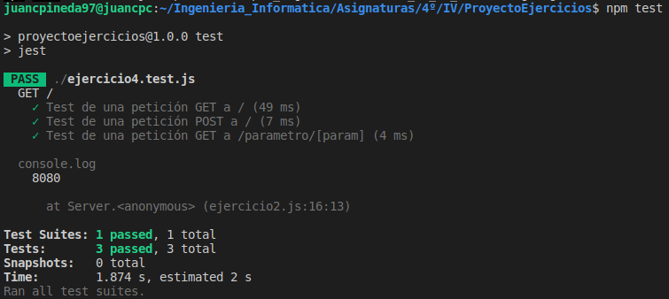
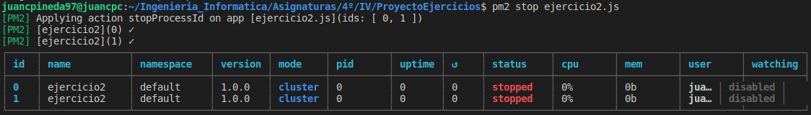
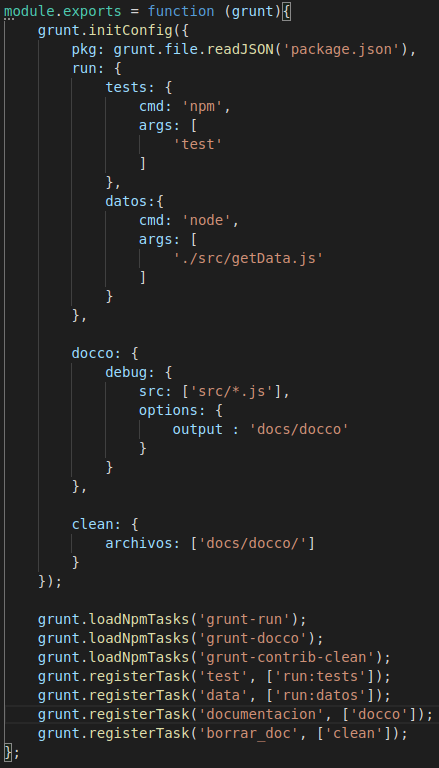

# Ejercicios Tema 6 - Microservicios

## Ejercicio #1
### Instalar etcd3, averiguar qué bibliotecas funcionan bien con el lenguaje que estemos escribiendo el proyecto (u otro lenguaje), y hacer un pequeño ejemplo de almacenamiento y recuperación de una clave; hacer el almacenamiento desde la línea de órdenes (con etcdctl) y la recuperación desde el mini-programa que hagáis.

Primero, tendré que instalar etcd en mi sistema con el siguiente comando:
~~~
sudo apt install etcd
~~~

Una vez instalado en mi sistema, instalaré el cliente etcd3 en mi repositorio con el siguiente comando:

Una vez hecho esto, ejecuto la orden `export ETCDCTL_API=3` para que funcione correctamente el cliente de etcd3.

Se probará el funcionamiento de esta utilidad con el siguiente [código](codigos/tema6/ejercicio1.js), inspirado en [esta fuente](https://www.npmjs.com/package/etcd3#quickstart):

Y, para probar el correcto funcionamiento, se almacenará una clave desde la línea de comandos, y después se ejecutará el código antes mostrado, y, como se puede ver, se recupera tanto la clave almacenada por línea de comandos como la clave que almacena el propio código:

## Ejercicio #2
### Realizar una aplicación básica que use express para devolver alguna estructura de datos del modelo que se viene usando en el curso.

Programaré una aplicación sencilla con el framework Express en Node aprovechando el repo del ejercicio anterior. Para ello, primero instalaré Express en el repositorio con el comando:
~~~
npm install --save-dev express
~~~

El [código](codigos/tema6/ejercicio2.js) de la aplicación es el siguiente:

En él, se puede apreciar que habrá dos rutas accesibles a través del método **GET**: *localhost:8080/* y *localhost:8080/parametro/[param]* . La primera, devolverá un mensaje indicando que se trata de la aplicación de prueba del ejercicio 2, y la segunda devolverá el mensaje de la primera más el parámetro de la URL que viene después de */parametro/*.

Cómo se puede apreciar en las siguientes capturas, la aplicación funciona correctamente:

## Ejercicio #3
### Programar un microservicio en express (o el lenguaje y marco elegido) que incluya variables como en el caso anterior.

*(Ya realizado en la segunda ruta accesible del ejercicio 2)*

## Ejercicio #4
### Crear pruebas para las diferentes rutas de la aplicación.

Para realizar los tests sobre la aplicación de los ejercicios anteriores, usaré la librería de aserciones *supertest*, la cuál instalaré en mi repositorio con el comando `npm install --save-dev supertest` .
Además, para ejecutar los tests, usaré el framework de tests *Jest*.

El [código](codigos/tema6/ejercicio4.test.js) de los tests realizados es el siguiente:

Y, cómo se puede apreciar en la siguiente captura, la aplicación pasa los tests correctamente:

## Ejercicio #5
### Experimentar con diferentes gestores de procesos y servidores web front-end para un microservicio que se haya hecho con antelación, por ejemplo en la sección anterior.

Para este ejercicio experimentaré con el gestor de procesos usado en el temario, **pm2**, con la aplicación creada para los ejercicios anteriores. Para ello, primero tengo que instalar pm2 en mi pc, por lo que ejecutaré la orden `npm install -g pm2`.

Una vez instalado, ya puedo lanzar pm2 con la siguiente orden que lanzará dos instancias de mi aplicación:
~~~
pm2 start ejercicio2.js -i 2
~~~

La cuál produce la siguiente salida:

En ella se puede ver de manera gráfica cómo se han creado dos instancias de la aplicación y más información sobre esta. Ahora, las instancias se estarán ejecutando en segundo plano, por lo que se puede realizar una petición a éstas perfectamente.
Si se quiere detener la ejecución de estas instancias, se usa el siguiente comando:
~~~
pm2 stop ejercicio2.js
~~~

que produce la siguiente salida:

en la que se indica que efectivamente se han detenido las dos instancias de la aplicación.

## Ejercicio #6
### Usar rake, invoke o la herramienta equivalente en tu lenguaje de programación para programar diferentes tareas que se puedan lanzar fácilmente desde la línea de órdenes un microservicio.

Para este ejercicio usaré *Grunt*, ya que ha sido usado para la aplicación de la asignatura. En esta aplicación, como se puede ver en el [archivo](https://github.com/juancpineda97/LaLigaStats/blob/main/Gruntfile.js) de configuración de Grunt, se han programado diferentes tareas cómo para ejecutar los tests, generar documentación o hacer *clean* :

