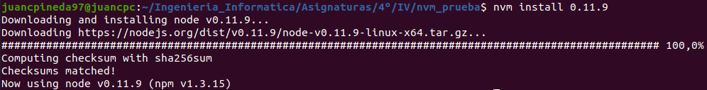
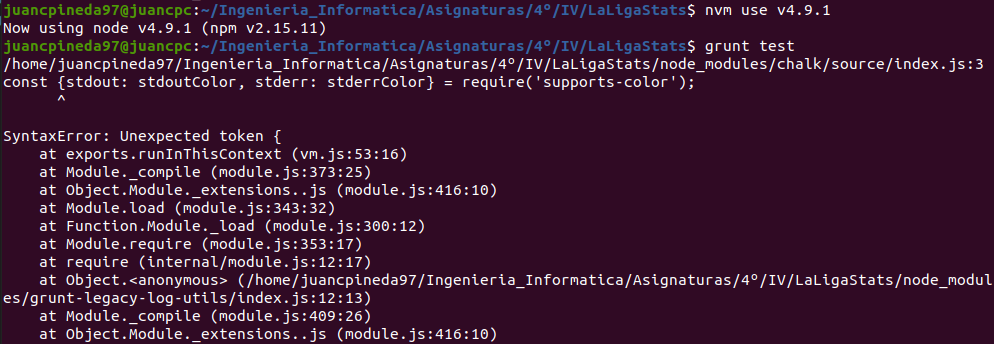

# Ejercicios Tema 4 - Desarrollo basado en pruebas

## Ejercicio #2
### Para la aplicación que se está haciendo, escribir una serie de aserciones y probar que efectivamente no fallan. Añadir tests para una nueva funcionalidad, probar que falla y escribir el código para que no lo haga (vamos, lo que viene siendo TDD).

En la aplicación que estoy realizando, [LaLigaStats](https://github.com/juancpineda97/LaLigaStats), he creado la siguiente biblioteca de aserciones:

Para probar que funcionan correctamente, se ha creado, por ejemplo, el siguiente test que usa varias de las funciones de la biblioteca:

Y, como se puede ver en la siguiente captura, la biblioteca de aserciones funciona correctamente:

Ahora, voy a añadir nuevos tests para una nueva funcionalidad de mi aplicación, la de mostrar al usuario los jugadores de un equipo:

Se crea el siguiente método para cumplir esta funcionalidad:

Y se ejecutan los tests con el siguiente resultado:

Como se puede ver, hay un tests que ha resultado fallido, el de mostrar jugadores de un equipo vacío, y como se puede ver, la salida no es la adecuada para un equipo sin jugadores, por lo que voy a cambiar el método creado de la siguiente forma para corregir el error:

Y, como se puede observar, ahora la aplicación pasa todos los tests correctamente:

## Ejercicio #3
### Crear algún conjunto de scripts de tests, usando tu lenguaje favorito, y ejecutarlos desde el marco de test más adecuado (o el que más te guste) para ese lenguaje.

Voy a crear un conjunto de scripts de tests para mi aplicación, por lo que se crearán en Javascript usando la biblioteca de aserciones creada anterioremente, [aquí](https://github.com/juancpineda97/LaLigaStats/blob/main/test/equipo-jugador.test.js) se pueden ver los scripts de tests creados. Estos tests se crean para ser ejecutados desde el marco de tests para Javascript **Jest**, y los puedo ejecutar, después de haber instalado Jest, con la orden *npm test*, y se puede ver la ejecución satisfactoria de todos los tests creados:

## Ejercicio #4
### Instalar alguno de los entornos virtuales de node.js (o de cualquier otro lenguaje con el que se esté familiarizado) y, con ellos, instalar la última versión existente, la versión minor más actual de la 4.x y lo mismo para la 0.11 o alguna impar (de desarrollo).

Voy a usar nvm para node.js, primero lo instalaré con el comando:
~~~
curl -o- https://raw.githubusercontent.com/nvm-sh/nvm/v0.37.0/install.sh | bash
~~~
Y, como se puede ver en la siguiente captura, nvm ya está instalado:

Ahora, instalaré la última versión:

También instalaré la versión minor más actualizada de 4.x:

Y también, la versión minor más actualizada de la 0.11:

Como se puede ver en la siguiente captura, ya tendría instaladas en mi sistema estas versiones junto a la que estaba instalada por defecto en el sistema:

## Ejercicio #5
### Como ejercicio, algo ligeramente diferente: un servicio web para calificar las empresas en las que hacen prácticas los alumnos.

Puesto que se puede realizar con otra aplicación, lo realizaré con mi aplicación de la asignatura: [LaLigaStats](https://github.com/juancpineda97/LaLigaStats)

## Ejercicio #6
### Ejecutar el programa en diferentes versiones del lenguaje. ¿Funciona en todas ellas?

Aprovechando que he instalado diferentes versiones de node en los ejercicios anteriores, voy a probar a ejecutar mi aplicación con éstas:

- **v0.11.9**

- **v4.9.1**

- **15.2.1**

Como se puede apreciar, de las versiones probadas, mi aplicación sólo funciona con la versión **15.2.1**