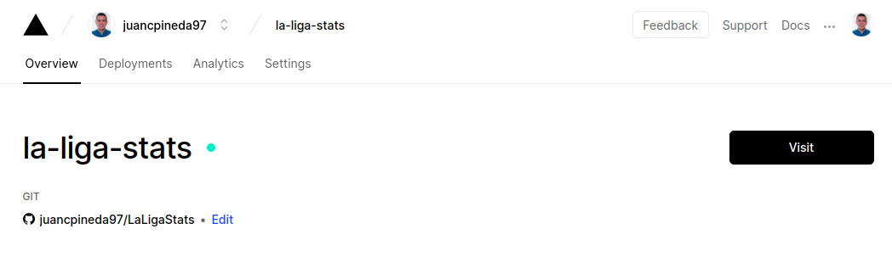
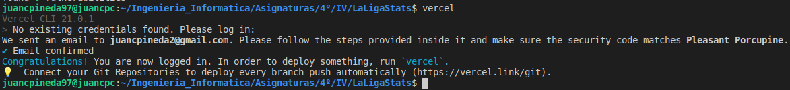

# Ejercicios Tema 5 - Serverless

## Ejercicio #1
### Darse de alta en Vercel y Firebase, y descargarse los SDKs para poder trabajar con ellos localmente.

En Vercel, me he dado de alta en su página web (vercel.com), usando mi cuenta de github, con lo que además en unos sencillos pasos he podido añadir a vercel mi repositorio del proyecto de la asignatura, como se ve en la siguiente imagen:

Además, me he descargado e instalado el el sdk de éste con el comando:
~~~
npm install -g vercel
~~~

Y, como se puede ver en la siguiente imagen, lo he configurado para poder usarlo en local:

En **Firebase** no haría falta darse de alta, ya que es posible usarlo con mi propia cuenta de Google.