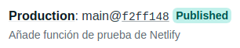

# Ejercicios Tema 5 - Serverless

## Ejercicio #1
### Darse de alta en Vercel y Firebase, y descargarse los SDKs para poder trabajar con ellos localmente.

En Vercel, me he dado de alta en su página web (vercel.com), usando mi cuenta de github, con lo que además en unos sencillos pasos he podido añadir a vercel mi repositorio del proyecto de la asignatura, como se ve en la siguiente imagen:

Además, me he descargado e instalado el el sdk de éste con el comando:
~~~
npm install -g vercel
~~~

Y, como se puede ver en la siguiente imagen, lo he configurado para poder usarlo en local:

En **Firebase** no haría falta darse de alta, ya que es posible usarlo con mi propia cuenta de Google.

## Ejercicio #2
### Tomar alguna de las funciones de prueba de Vercel, y hacer despliegues de prueba con el mismo.

Para realizar este ejercicio he utilizado la siguiente función de prueba de Vercel:

La cuál guardaré en el archivo *api/hello.js* de mi proyecto, por lo que al hacer el despliegue en Vercel, accediendo a la URL https://la-liga-stats.vercel.app/api/hello.js se puede ver cómo se ejecuta la función:

## Ejercicio #3
### Tomar alguna de las funciones de prueba de Netlify, y hacer despliegues de prueba con el mismo.

Primero, al igual que con Vercel, me registraré en la web de [Netlify](https://www.netlify.com/) usando mi cuenta de GitHub. Después, instalaré netlify en mi PC con el comando `npm install -g netlify-cli`, y después, iniciaré sesión desde la terminal con el comando `netlify login`:

Ahora ya puedo realizar el primer despliegue de mi aplicación en Netlify con el comando `netlify deploy`, en el que le indico algunas de las opciones de configuración del despliegue, y, como se puede observar, ha sido satisfactorio:

Ahora, necesito crear el archivo *netlify.toml*, en el que le indicaré a netlify el directorio dónde están las funciones a desplegar:

Luego creo una función de prueba dentro del directorio indicado en el archivo de configuración:

Justo después, desde la interfaz web de Netlify, le indico también que las funciones a desplegar están en el directorio *functions*:

Una vez hecho esto, puedo hacer push de mi repositorio con los cambios realizados, y se ejecutará el despliegue automáticamente como se puede ver:

En la sección functions de la interfaz web de netlify se pueden ver las funciones desplegadas, en mi caso, veo mi función creada de ejemplo:

Y, accediendo al *endpoint* de esta función, se puede comprobar su correcto funcionamiento:

